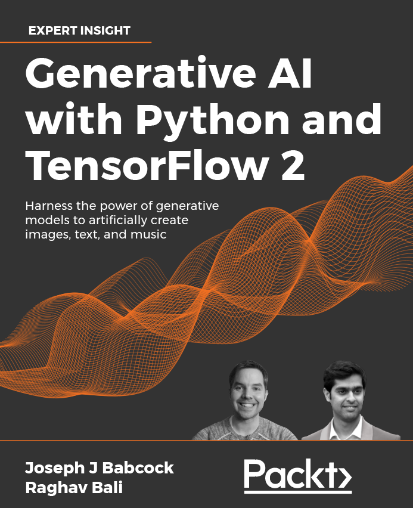

# Hands-On-Generative-AI-with-Python-and-TensorFlow-2
> Harness the power of generative models to create images, text, and music
>> Published by Packt by Joseph Babcock and Raghav Bali

From artworks and music compositions to synthetic medical datasets, generative modeling is pushing the boundaries of imagination and intelligence alike. The aim of [*__"Hands-On-Generative-AI-with-Python-and-TensorFlow-2"__*](https://github.com/raghavbali/generative_ai_with_tensorflow#contents), is to be a kaleidoscope of the generative modeling space and cover a wide range of topics. This book takes you on a journey where you don’t just read the theory and learn about the fundamentals but also discover the potential and impact of these models through workable examples. This book will broadly cover aspects such as:

+ Explore creative and human-like capabilities of AI and generate impressive results
+ Use the latest research to expand your knowledge beyond this book
+ Experiment with practical TensorFlow 2.x implementations of state-of-the-art generative models

This repository contains all the code, notebooks and examples used in this book. We will also be adding bonus content here from time to time. So keep watching this space!

## Get the book
<table style="width:100%" >
  <tr>
    <td>
      
    </td>
  </tr>
</table>

## About the book

In recent years, generative artificial intelligence has been instrumental in the creation of lifelike data (images, voice, video, music, and text) from scratch. In this book you will unpack how these powerful models are created from relatively simple building blocks, and how you might adapt these models to your own use cases.

You will begin by setting up clean containerized environments for Python and getting to grips with the fundamentals of deep neural networks, learning about core concepts like the perceptron, activation functions, backpropagation, and how they all tie together. Once you have covered the basics, you will explore deep generative models in depth, including OpenAI’s GPT-series of news generators, networks for style transfer and deepfakes, and synergy with reinforcement learning.

As you progress, you will focus on abstractions where useful, and understand the “nuts and bolts” of how the models are composed in code, underpinned by detailed architecture diagrams. The book concludes with a variety of practical projects to generate music, images, text, and speech using the methods you have learned in prior sections, piecing together TensorFlow layers, utility functions, and training loops to uncover links between the different modes of generation.

By the end of this book, you will have acquired the knowledge to create and implement your own generative AI models.

Edition: 1st &emsp; Pages: 453 &emsp; Language: English 
Book Title: Generative AI with Python and TensorFlow 2 &emsp; Publisher: Packt 
Copyright: Babcock & Bali &emsp; 

 
 

## [Contents](https://github.com/raghavbali/generative_ai_with_tensorflow#book-contents)  
- [Chapter 6: Image Generation with GANs](https://github.com/raghavbali/generative_ai_with_tensorflow/tree/master/Chapter_6)
- [Chapter 7: Style Transfer with GANs](https://github.com/raghavbali/generative_ai_with_tensorflow/tree/master/Chapter_7)
- [Chapter 8: Deepfakes with GANs](https://github.com/raghavbali/generative_ai_with_tensorflow/tree/master/Chapter_8)
- [Chapter 9: The Rise of Methods for Text Generation](https://github.com/raghavbali/generative_ai_with_tensorflow/tree/master/Chapter_9)
- [Chapter 10: NLP 2.0: Using Transformers to Generate Text](https://github.com/raghavbali/generative_ai_with_tensorflow/tree/master/Chapter_10)
- [Chapter 11: Composing Music with Generative Models](https://github.com/raghavbali/generative_ai_with_tensorflow/tree/master/Chapter_11)

## What You Will Learn:
+ Implement paired and unpaired style transfer with networks like StyleGAN
+ Use facial landmarks, autoencoders, and pix2pix GAN to create deepfakes
+ Build several text generation pipelines based on LSTMs, BERT, and GPT-2, learning how attention and transformers changed the NLP landscape
+ Compose music using LSTM models, simple generative adversarial networks, and the intricate MuseGAN
+ Train a deep learning agent to move through a simulated physical environment
+ Discover emerging applications of generative AI, such as folding proteins and creating videos from images

 

## Audience
This book will appeal to Python programmers, seasoned modelers, and machine learning engineers who are keen to learn about the creation and implementation of generative models. To make the most out of this book, you should have a basic familiarity with probability theory, linear algebra, and deep learning.
__Basic proficiency in ML and Python is required.__

